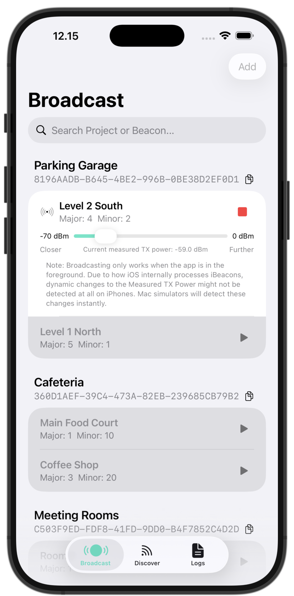
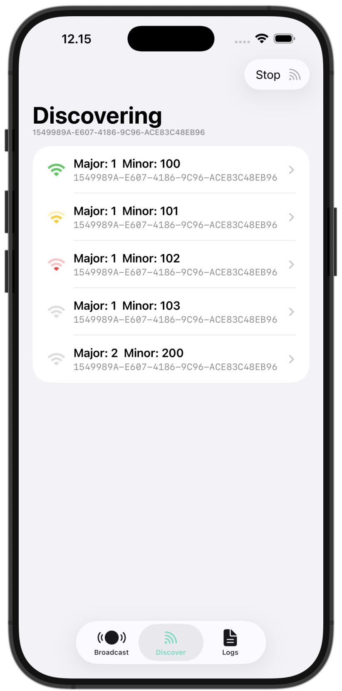
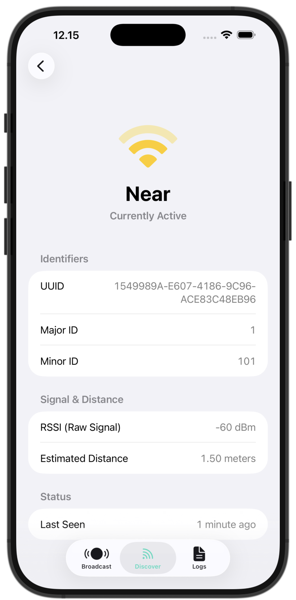
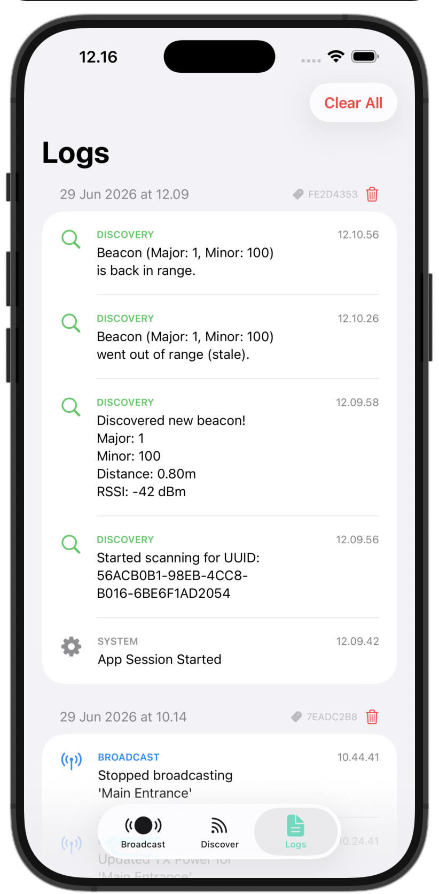
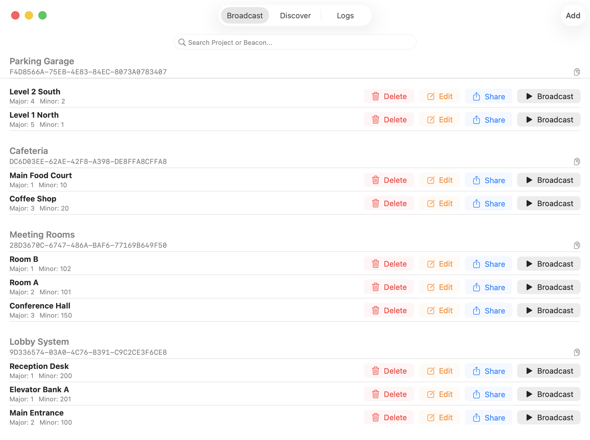
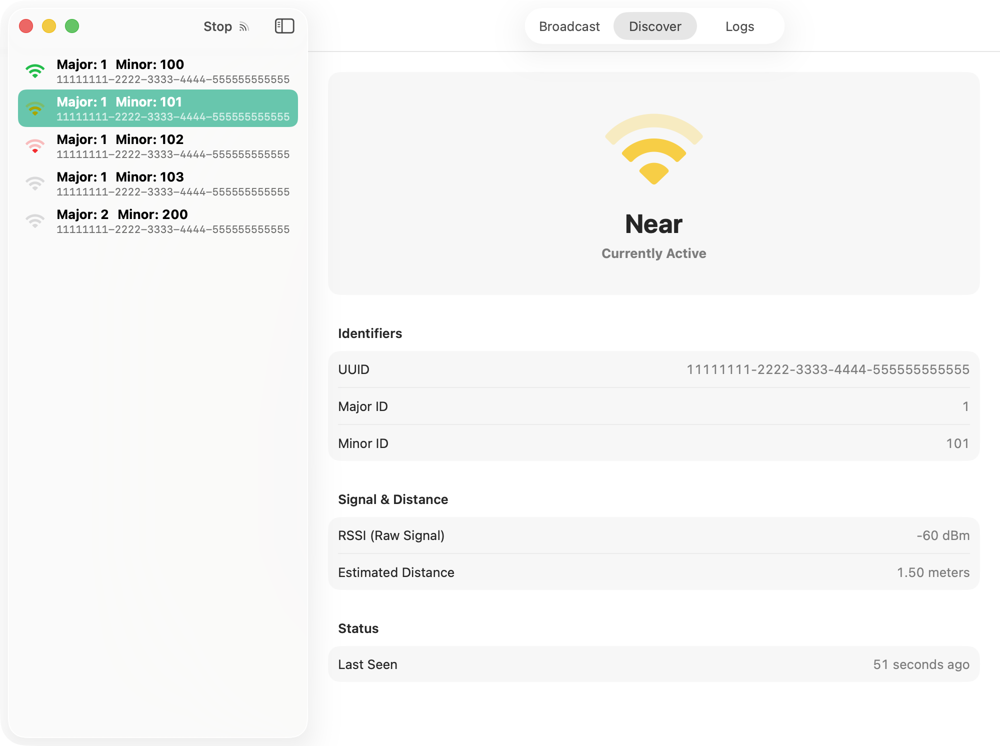
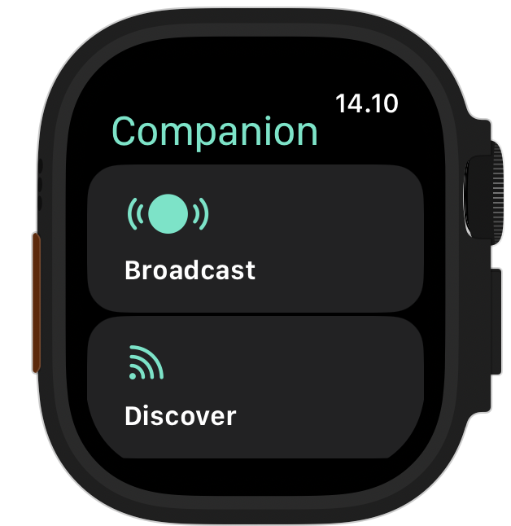
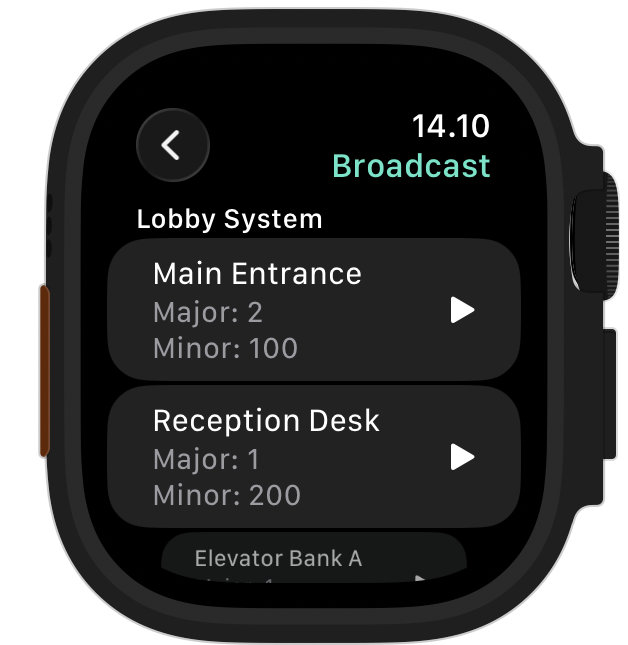
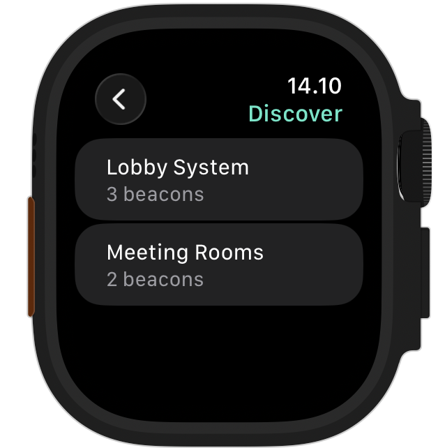

  

  # Your Beacon Simulator

  A native, multi-platform utility designed to simulate, broadcast, and discover iBeacons across iOS, iPadOS, macOS, and watchOS.
  
  <!-- Badges -->
  

    
    
    
    
    
  

  

---

## Overview

Your Beacon Simulator eliminates the need for physical beacon hardware when testing location-based applications, indoor navigation, or proximity marketing triggers. Built entirely in modern Swift, it leverages device capabilities to turn your iPhone, iPad, or Mac into a fully functioning, configurable iBeacon, while also acting as a highly accurate scanner for existing beacons in your environment. An optimized watchOS companion extension lets you effortlessly manage and track active workflows straight from your wrist.

### iOS Previews

  
  
  
  

### macOS Previews

  
  

### watchOS Previews

  
  
  

## Support

If you have questions, need technical assistance, or would like to report a bug, I'm happy to help.

### Contact

- **Email:** [akbar@reishandy.id](mailto:akbar@reishandy.id)
- **Report an Issue:** [https://github.com/Reishandy/SwiftUI-YourBeaconSimulator/issues/new](https://github.com/Reishandy/SwiftUI-YourBeaconSimulator/issues/new)
- **Privacy Policy:** [https://policy.reishandy.id/#yourbeaconsimulator](https://policy.reishandy.id/#yourbeaconsimulator)

When reporting an issue, please include your device model, operating system version, and a brief description of the problem so I can investigate it as quickly as possible.

## Key Features

### iBeacon Broadcasting
* **Project-Based Organization:** Group multiple virtual beacons under a single Proximity UUID for clean organization, backed by SwiftData.
* **Full Configuration:** Define custom Major and Minor IDs for every virtual beacon.
* **Real-Time TX Power Calibration:** Dynamically adjust the "Measured TX Power" on the fly for accurate proximity calibration.
* **Quick Share:** Export and share beacon configurations (UUID, Major, Minor) instantly as text.

### Advanced Discovery & Scanning
* **Targeted Scanning:** Input a specific Proximity UUID to actively scan for associated beacons.
* **Session Persistence:** Saves the active UUID and resumes scanning on the next app cold start.
* **Real-Time Proximity Dashboard:** Live list of discovered beacons with dynamic visual indicators for Immediate, Near, Far, and Unknown states.
* **Smart Sorting & State Tracking:** Automatically dims stale beacons that drop off the radar and sorts active ones by closest proximity.
* **Deep-Dive Metrics:** Inspect raw RSSI (Signal Strength), estimated distance in meters, and last-seen timestamps.

### Apple Watch Companion Control
* **Remote Session Toggling:** Instantly fire commands to trigger, adjust, or completely halt active iBeacon broadcasts and discovery scanning from your wrist.
* **Live State Mirroring:** Real-time view of active beacon streams, current project parameters, and continuous list synchronizations for discovered peripherals.
* **Contextual Lifecycle Guarding:** Integrated safety blockers instantly alert you if the host iOS app falls into the background, preventing silent routine termination by the OS.
* **Tailored Wearable UI:** Native carousel-styled menu navigation accented by persistent modal view overlays for active running states and tactical haptic feedback loops.

### Background Monitoring
* **Always-On Regions:** Utilizes CoreLocation to monitor UUID regions even when the app is minimized or killed.
* **Background Ranging:** Temporarily wakes the app upon region entry to pinpoint the exact beacon (Major/Minor) that triggered the event.
* **Rich Notifications:** Delivers detailed local alerts on entry (e.g., "Found 2 beacons nearby") and exit, along with haptic feedback for foreground discoveries.

### Session-Based Live Logging
* **Real-Time Event Stream:** Track background region changes, active scanning state shifts, and beacon discoveries in an organized chronological ledger.
* **Granular Beacon Metrics:** View immediate snapshot data upon discovery, including UUID targets, Major/Minor IDs, real-time RSSI fluctuations, and exact calculated distances.
* **State Lifecycle Tracking:** Visually audit when a beacon transitions out of range (`stale`) and exactly when it is re-discovered.
* **Ephemeral Memory Footprint:** Built as session-isolated logs with quick-clear capabilities to keep your debugging environment lightweight and private.

## Technical Architecture

This project was built to explore the boundaries of Apple's cross-platform frameworks and Bluetooth stacks. 

* **Multi-Platform Native:** Built with SwiftUI, utilizing adaptive layouts (`TabView` for iOS, `NavigationSplitView` with custom window resizing for macOS, and a `carousel` list configuration for watchOS).
* **Framework Bridging:** 
  * **macOS:** Implements a custom `CoreBluetooth` (`CBCentralManager`) scanner with a bespoke Low-Pass Filter algorithm to stabilize erratic RSSI readings, alongside manual distance calculation via log-distance path loss approximation. Broadcasting utilizes undocumented CoreBluetooth payload construction.
  * **iOS / watchOS:** Leverages native `CoreLocation` (`CLLocationManager` and `CLBeaconRegion`) for robust, system-level monitoring.
* **Optimized Dual-Channel Pipeline:** Incorporates low-latency `WatchConnectivity` state syncing. Employs `sendMessage` transactions for real-time immediate updates during foreground active tracking, backed by an `updateApplicationContext` fallback pipeline using monotonic timeline delta matching to eliminate rendering jitter and redundant JSON overhead.
* **Modern Swift Concurrency:** Fully integrates Swift 6 features, specifically the new `@Observable` macro for thread-safe state management across ViewModels, Services, and Watch extensions.
* **Data Persistence:** SwiftData handles local storage, with iCloud CloudKit synchronization seamlessly propagating configurations across devices.
* **Centralized Permissions Engine:** Asynchronously manages the complex matrix of Bluetooth, Always-On Location, and Notification authorizations across different operating systems.

## Tech Stack

* **Framework:** SwiftUI
* **Language:** Swift 6
* **Data Management:** SwiftData & CloudKit
* **Hardware & Communication APIs:** CoreLocation, CoreBluetooth, WatchConnectivity
* **Architecture:** MVVM

## License

This project is licensed under the GNU Affero General Public License v3.0 (AGPL-3.0). This ensures that the spirit of open-source collaboration is maintained. See the LICENSE file for full details.

---

  <b>Created by Muhammad Akbar Reishandy</b> 
  <a href="mailto:akbar@reishandy.id">Email</a> |
  <a href="https://reishandy.id">Website</a> |
  <a href="https://github.com/Reishandy">GitHub</a> |
  <a href="https://www.linkedin.com/in/reishandy/">LinkedIn</a>

